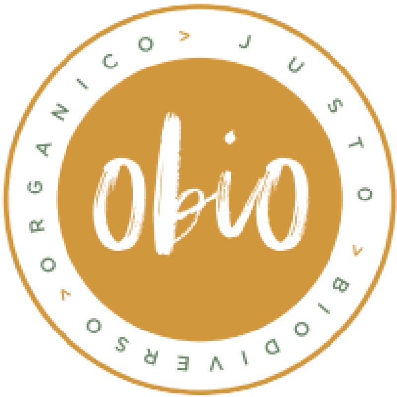

<p align="center">
  
</p>

# OBIO APP

Puedes verlo aquí: https://nivermtz.github.io/obio-app/

# 📌 Tecnologias

Proyecto creado con:
* React
* HTML 5
* CSS 3
* JS (ES8)

# 📱 UX Móvil

<p align="center">
  
</p>
 UX realizada en https://www.figma.com/file/eN25pcWmCaQqd1x2fBeByA/App-Customer/

# 🌟 Autor

* **Equipo CreeC**  - [Link a nuestros recursos en BlockAcademy](https://hackathons.blockdemy.com/es/p/60e2c82f9cbaea0031d006f0/)

> Este proyecto fue creado como parte de las actividades del Talent Hackathon 2021 CityBanamex.
[Track – Comercio sustentable y sostenible de pequeños productores – Citibanamex](https://hackathon.talent-network.org/track-comercio-sustentable-y-sostenible-de-pequenos-productores-citibanamex/)

# 📑 Notas

> Este proyecto actualmente fue desarrollado en React por ser la tecnología más robusta que conocemos. Sin embargo, tal que está pensado para ser una app móvil, reconocemos que
React Native es una mejor opción. Esperamos que esa fase de desarrollo móvil se inicié una vez demostrado el funcionamiento de este prototipo web, que intenta dar una
aproximación de lo que se tiene en mente según nuestro diseño de UX, mediante media querys en diseño responsivo, tal que se puede acceder con F12 y activando la visión de dispositivo móvil.

# 👨‍💻 Usabilidad

Para utilizar este proyecto

```
$ git clone https://github.com/NiverMtz/obio-app.git
$ cd obio-app
$ npm install
$ npm start
```
